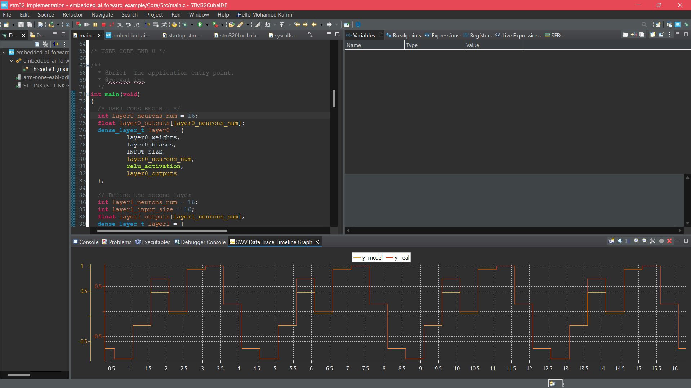

# Embedded AI Using Neural Networks from Scratch

This project demonstrates how to build a neural network for embedded applications from scratch. Starting with neural network utilities using Python and NumPy, we will develop the training part in Python. For the embedded part, we will use the C programming language to build a neural network that utilizes pre-trained models generated in Python and performs forward propagation successfully.

We will use the example of generating a sine wave for demonstration purposes. The model will consist of 1 input neuron representing `x`, 1 output neuron representing `y = sin(x)`, and two hidden layers with 16 neurons each.

## Table of Contents

1. [Introduction](#introduction)
2. [Documentation](#documentation)
3. [Setup](#setup)
    - [Clone the Repository](#clone-the-repository)
    - [Create a Virtual Environment](#create-a-virtual-environment)
    - [Activate the Virtual Environment](#activate-the-virtual-environment)
    - [Install Required Packages](#install-required-packages)
    - [Run the Project](#run-the-project)
4. [Embedded System Application Setup](#embedded-system-application-setup)

## Introduction

This project aims to bridge the gap between Python-based neural network training and deploying the trained model on an embedded system using C. The target application is a sine wave generator implemented on an STM32 microcontroller.

## Documentation

The [docs](docs/Embedded_Artificial_Intelligence.pdf) folder contains comprehensive documentation covering the theory and development process of the neural network. Topics include:
- Forward propagation
- Backpropagation
- Layers and neurons
- Activation functions

## Setup

Follow these steps to set up the project on your local machine:

### Clone the Repository

    ```sh
    git clone https://github.com/Med-Karim-Ben-Boubaker/Neural-Network-From-Scratch.git
    cd Neural-Network-From-Scratch
    ```

### Create a Virtual Environment

```sh
python3 -m venv myenv
```

### Activate the Virtual Environment

On Windows:
```sh
myenv\Scripts\activate
```

On macOS and Linux:
```sh
source myenv/bin/activate
```

### Install Required Packages

```sh
pip install -r requirements.txt
```

### Run the Project

You can run the project in two ways:

1. **Using Jupyter Notebook:**
    Open the `main.ipynb` Jupyter notebook and run all cells to visualize the training process and predictions.

2. **Using Python Script:**
    ```sh
    cd my_project/
    python3 run.py
    ```

    This script will create, train, and generate the model ready to be used by the C program simulating its implementation in an embedded system. The generated file, `model_weights.c`, contains the weights for the neural network.

    Example of generated weights for a layer:
    ```c
    // Define layer0 weights
    float layer0_weights[16] = {
        -0.08466117829084396,
        0.5169710516929626,
        0.18730637431144714,
        0.5202388167381287,
        0.31740641593933105,
        -0.09392301738262177,
        0.3741433918476105,
        -0.15243594348430634,
        0.17482277750968933,
        0.3164679706096649,
        0.12593820691108704,
        0.5449357628822327,
        -0.09343516081571579,
        -0.06662387400865555,
        0.11048824340105057,
        0.3304210305213928
    };
    ```

### Build the C Model Implementation

Navigate to the `c_model_implementation/` folder and run `make` to build the project:

```sh
cd c_model_implementation
make
```

### Run the Executable

```sh
./main_program
```

Expected output:
```txt
Predicted Output of sin(0.000000): 0.058686 -- Actual Value Sin(0.000000) = 0.000000
Predicted Output of sin(1.000000): 0.938980 -- Actual Value Sin(1.000000) = 0.841471
Predicted Output of sin(2.000000): 0.997239 -- Actual Value Sin(2.000000) = 0.909297
Predicted Output of sin(3.000000): 0.237309 -- Actual Value Sin(3.000000) = 0.141120
Predicted Output of sin(4.000000): -0.650306 -- Actual Value Sin(4.000000) = -0.75680
Predicted Output of sin(5.000000): -0.856960 -- Actual Value Sin(5.000000) = -0.95892
```

## Embedded System Application Setup

Inside the `my_project` folder, there is a `stm32_implementation` folder containing an embedded AI project for the STM32F407 Discovery Board. Open this project using STM32CubeIDE to run the sine wave model on the board.

Example of the generated sine wave and actual values:


This plot verifies the functioning of our sine wave generation model.